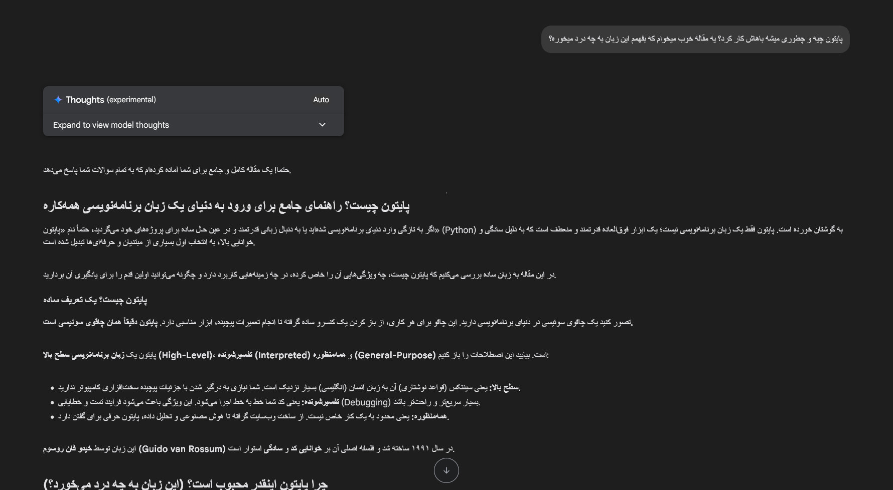
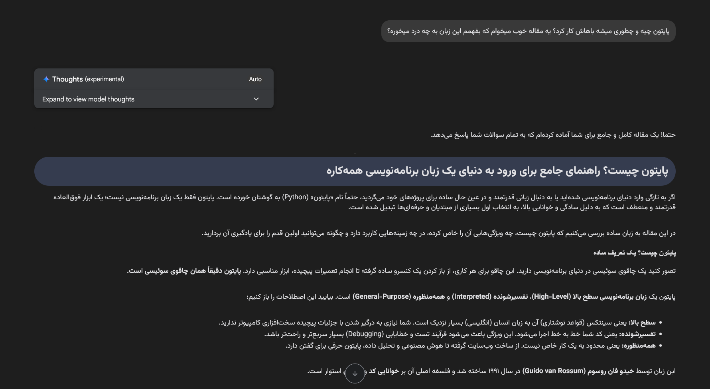

# Gemini & AI Studio RTL Fix

  

  یک افزونه فایرفاکس برای بهبود تجربه کاربری فارسی در سایت‌های Gemini و AI Studio گوگل.
   
  A Firefox add-on to improve the Persian user experience on Google's Gemini & AI Studio.

  
  

---

## مشکل چیست؟ (The Problem)

استفاده از ابزارهای هوش مصنوعی گوگل مانند Gemini و AI Studio برای کاربران فارسی‌زبان به دلیل چپ‌چین بودن (LTR) محیط چت، دشوار و ناخواناست. این افزونه با هدف حل این مشکل طراحی شده است.

## ✨ ویژگی‌ها (Features)

*   **راست‌چین‌سازی کامل**: محیط ورود متن، پیام‌های شما و پاسخ‌های هوش مصنوعی به صورت کامل راست‌چین (RTL) می‌شوند.
*   **فونت خوانا و زیبا**: فونت استاندارد و محبوب وزیرمتن (Vazirmatn) برای تمام متون فارسی اعمال می‌شود.
*   **سبک و سریع**: فقط با استفاده از CSS و بدون هیچ کد جاوااسکریپتی، تاثیری بر سرعت سایت‌ها ندارد.
*   **امن و خصوصی**: این افزونه هیچ‌گونه اطلاعاتی را جمع‌آوری یا ارسال نمی‌کند. کد منبع آن برای بررسی در دسترس همگان است.

## 🚀 نصب (Installation)

می‌توانید این افزونه را مستقیماً از فروشگاه افزونه‌های فایرفاکس نصب کنید:

**[Install from Mozilla Add-ons (AMO)](https://addons.mozilla.org/en-US/firefox/addon/gemini-ai-studio-rtl-fix/)**

## 📸 تصاویر (Screenshots)

**قبل (Before):**

**بعد (After):**

## 📜 مجوز (License)

این پروژه تحت مجوز [MIT License](LICENSE) منتشر شده است.
